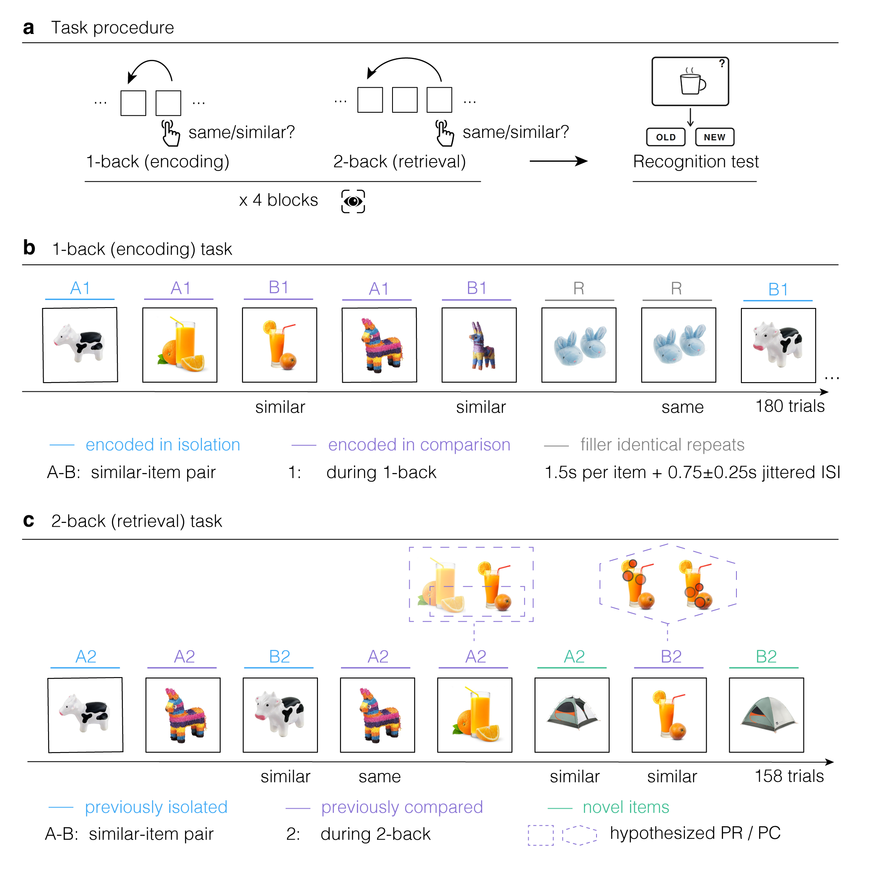
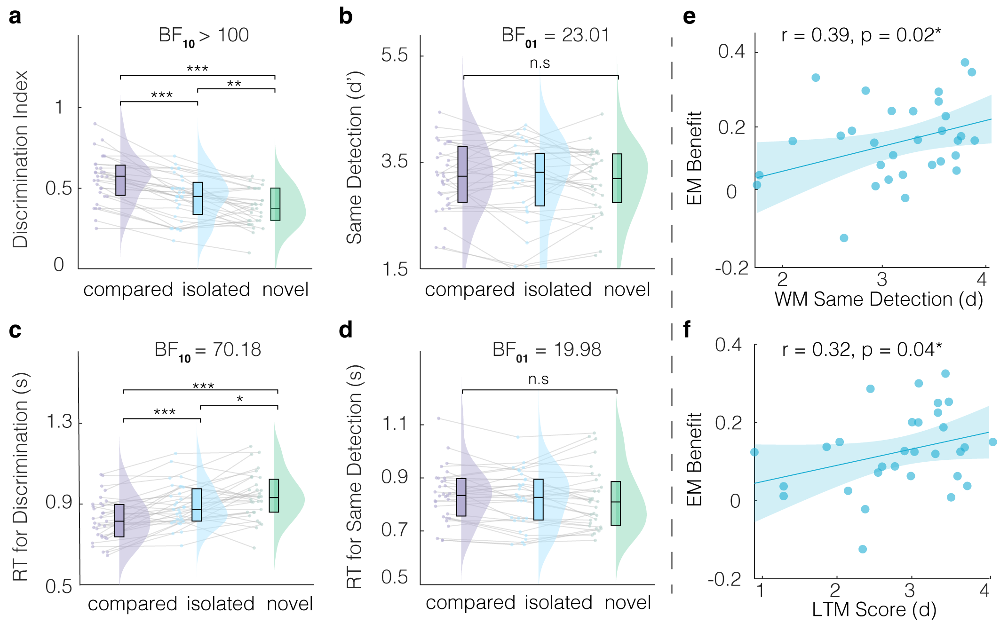
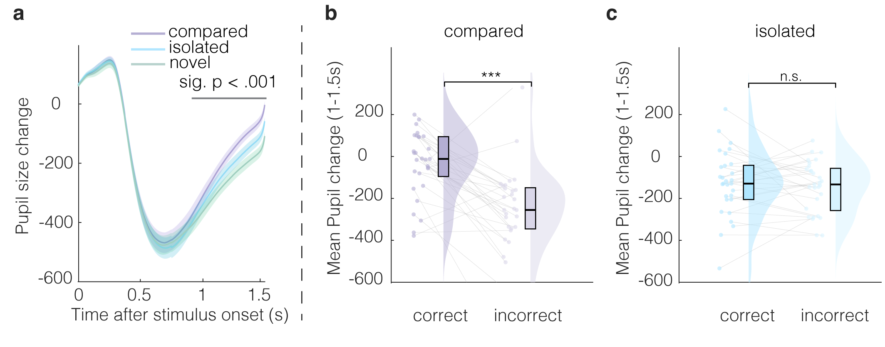
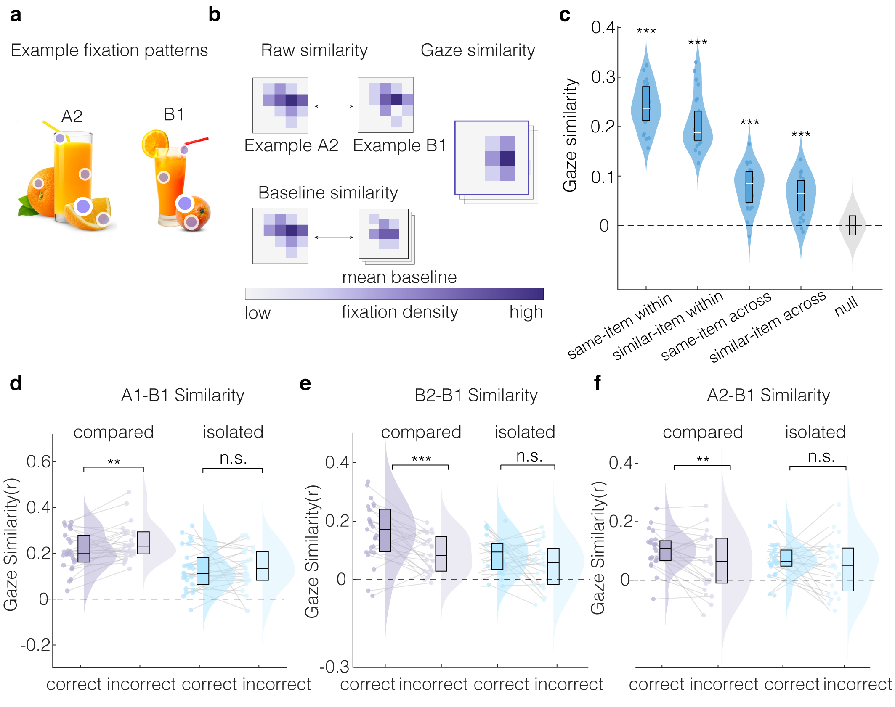
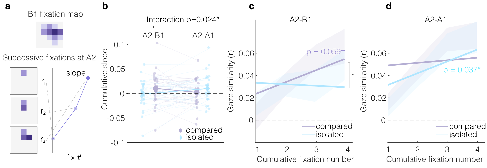
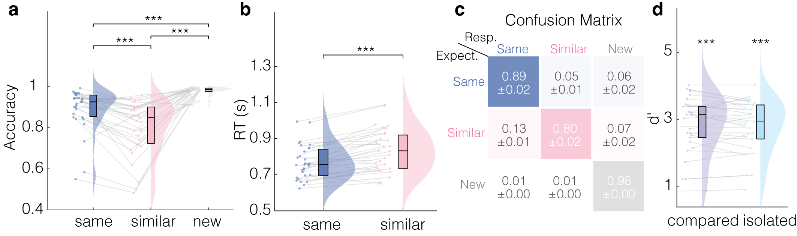
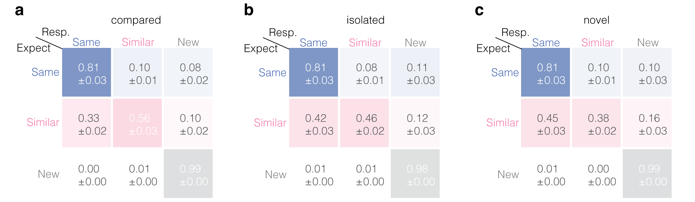
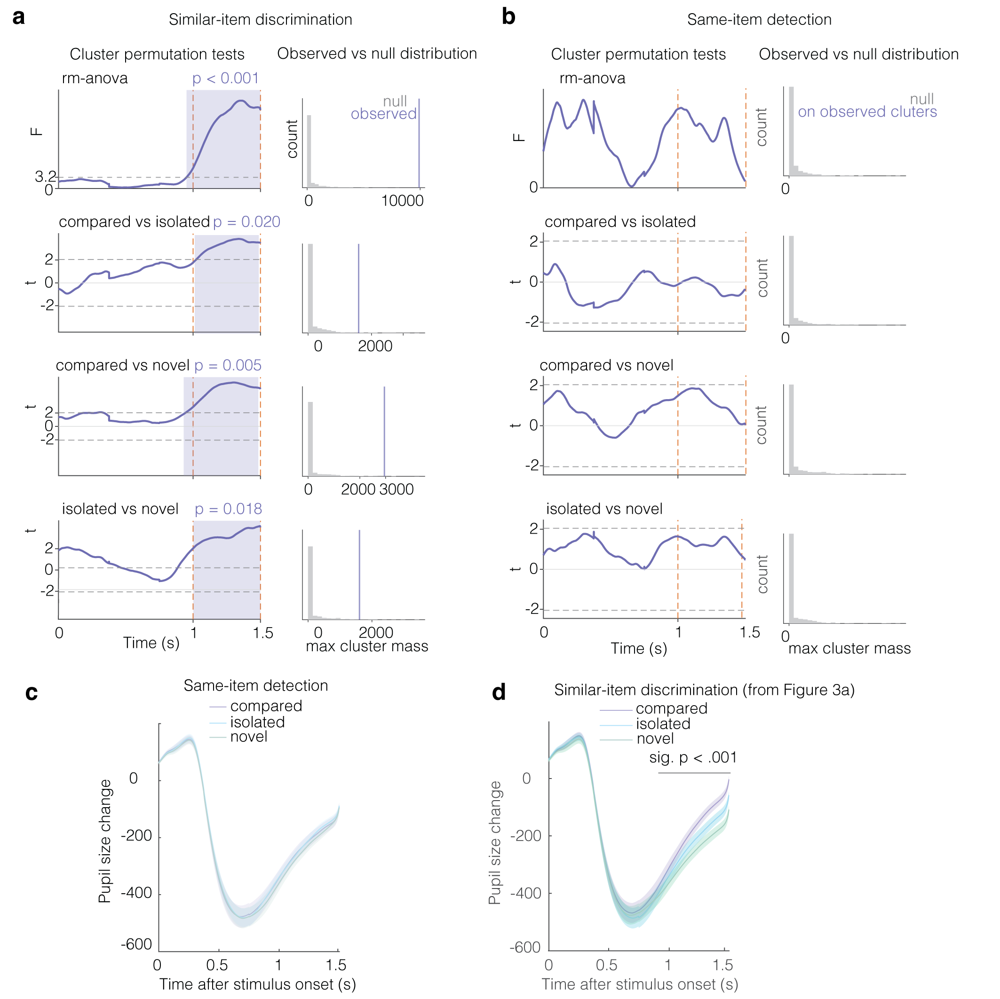
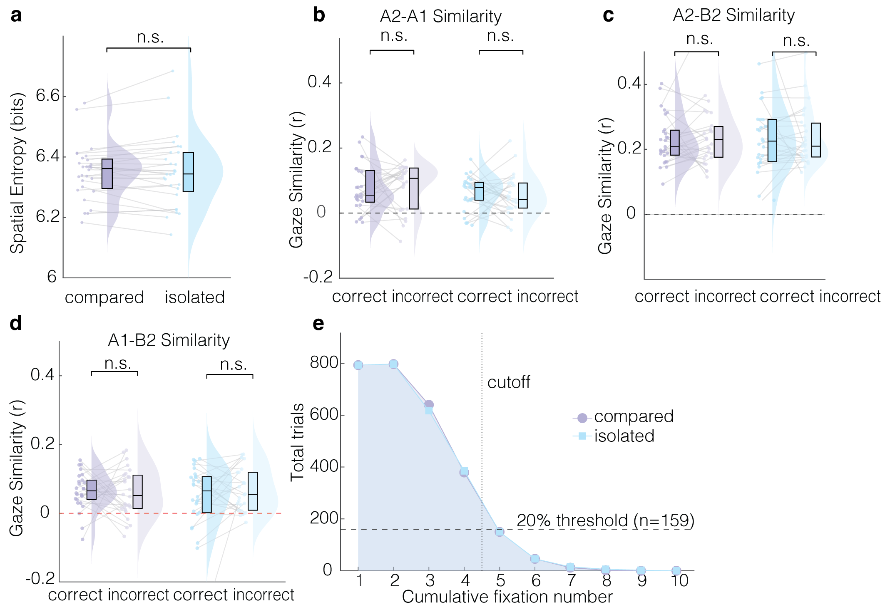

# Main {#sec:introduction .unnumbered}

Humans routinely discriminate among similar objects, for instance, when
picking out the right medication among nearly identical bottles -- such
discrimination requires maintaining, comparing, and updating recent
information. Working memory (WM) has conventionally been credited as the
system that supports this process, holding task-relevant information
over short intervals via active neural maintenance
[@baddeley1992; @luckVogel1997; @fusterAlexander1971; @constantinidis2018].
Crucially, WM is capacity-limited and its representations degrade
rapidly [@oberauerLewandowsky2014]. This is a consequential limitation
for the comparison of many similar items, which hinges on the
persistence of detailed representations. In continuous everyday
experience, where large amounts of information arrive rapidly, durable
memory traces may therefore be required to support discrimination
performance when WM capacity is exceeded.

Episodic memory (EM) can reactivate traces of specific past experiences
[@tulving1983] and has long been studied as a functionally and neurally
separate module from WM
[@atkinsonShiffrin1968; @baddeleyHitch1974; @tulving1983; @squireZolaMorgan1991; @baddeley1992].
While WM processes have been attributed to persistent neural activity in
the prefrontal cortex [@goldman-rakicCellularBasisWorking1995], episodic
memory formation and retrieval have been linked to long term synaptic
plasticity in the hippocampal formation
[@scovilleLossRecentMemory1957; @josselynMemoryEngramsRecalling2020].
Accordingly, episodic contributions to WM tasks have often been treated
as confounds to be controlled rather than mechanisms to be characterized
[@oberauerWhenDoesEpisodic2023].

Recent work has sparked renewed debate about how the two systems
interact. WM content persists across delays in which neural activity
returns to baseline [@lewisPeacock2012; @rose2016; @wolff2017], which is
difficult to reconcile with a strict active-maintenance account
[@goldman-rakicCellularBasisWorking1995]. The activity-silent WM
framework proposes that transient synaptic modifications realize WM
maintenance in the absence of persistent activity [@stokes2015], yet
persistent memory without active maintenance is also commensurate with
an EM mechanism [@beukers2021]. Consistent with a supportive role, EM
can extend WM capacity for associative bindings [@bartschOberauer2023];
however, the spontaneous reinstatement of EM neural activity patterns
during active maintenance has also been shown to interfere with WM
content [@hoskin2019]. An important open question is therefore, whether
EM can rescue WM performance by supplying additional task-relevant
content when WM capacity is exceeded, and if so, what mechanisms endow
EM with this ability.

Two candidate hippocampal computations could support discrimination of
similar content via EM. At encoding, hippocampal pattern separation in
the dentate gyrus (DG) subfield is required to store highly similar
experiences as distinct long-term memory traces
[@yassaPatternSeparationHippocampus2011; @bakkerPatternSeparationHuman2008; @favila2016].
At retrieval, pattern completion recovers a memory trace via
autoassociative connections in the CA3 subfield
[@hornerPatternCompletionMultielement2014; @hornerEvidenceHolisticEpisodic2015; @rollsPatternSeparationCompletion2016; @ngoPatternSeparationPattern2021].

Naturalistic work on repeated story-listening has further demonstrated
that EM can be recruited on-demand to predict upcoming information.
Intracranial recordings in auditory processing regions showed
spontaneous predictive recall after a single exposure to a story:
anticipatory neural activity emerged on the second listen and was
characterized by information flow from hippocampus to cortex
[@michelmann2021] (see also [@hindyLinkingPatternCompletion2016]). This
work is evidence that EM is recruited automatically and at fast
timescales to resolve ambiguity in real-world experiences. Such
predictive recall is another candidate mechanism to support WM
discrimination, providing information about potential future experience.

Eye-tracking offers a trial-level readout of such EM processes: Pupil
dilation indexes the recognition of previously studied items
[@otero2011] and the discrimination of similar lure items from
previously studied targets [@pajkossy2020]. Hippocampal activity has
further been shown to drive eye movements toward memory-relevant
locations [@hannulaRanganath2009]. At encoding, when the visual
environment cannot be encoded in a single fixation, gaze allocation
constrains which features enter memory [@wynn2019]. At retrieval,
fixation patterns then recapitulate the encoding episode in the absence
of the original stimulus [@wynn2020]. Gaze patterns thus provide a
valuable and time-resolved index of the perceptual content laid out
during encoding and recovered at retrieval.

To probe the mechanisms by which EM can support WM, we developed the
MST-back paradigm that combines two established EM and WM tasks within a
single framework. We embedded mnemonic discrimination judgements of
similar looking everyday objects [@stark2019] in a continuous N-back
task [@kirchner1958]: Participants, undergoing eyetracking compared
objects to their n$^{th}$ predecessor, classifying them as same,
similar, or new (no response required). A low WM load (one-back)
condition served as an incidental encoding task (Figure 1b). In a
subsequent high WM load (two-back) condition, some pairs from the
one-back phase were repeated (Figure 1c). We further manipulated how
pairs of items were experienced during one-back: *Compared* pairs
appeared consecutively, enabling direct detection of distinguishing
features; *isolated* pairs were separated by at least 5 intervening
items. In contrast, *novel* pairs appeared for the first time during
two-back.

<figure id="fig:figure1" data-latex-placement="h!t">

<figcaption><strong>The MST-back task and experimental
paradigm.</strong> <strong>a</strong> Task procedure: In two task
phases, participants judged each item relative to its n<em>t</em><em>h</em> predecessor
as same, similar, or new (no response). Each block contained a one-back
phase (used to elicit episodic memory encoding) followed by a two-back
phase, in which some items from the one-back phase reappeared to test
for episodic retrieval effects. Participants completed four task blocks
while undergoing eye tracking. A final old/new recognition test measured
long-term memory for items encountered during one-back. Notation: A and
B denote the two members of a perceptually similar pair, numbers (1 and
2) denote the task phase in which the item appeared (one-back vs.
two-back). <strong>b</strong> One-back phase. In the <em>compared</em>
condition, A1 and B1 appeared on consecutive trials, allowing direct
comparison between similar items. In the <em>isolated</em> condition, A1
and B1 were separated by at least 5 intervening items, limiting direct
comparison. Gray items indicate filler identical repeats (R). Each item
was presented for 1.5 s followed by a jittered inter-stimulus interval
of 0.75 plus or minus 0.25 s. <strong>c</strong> Two-back phase.
Previously <em>compared</em>, previously <em>isolated</em>, and
<em>novel</em> pairs appeared as A2 and B2, separated by an intervening
item, within a continuous two-back stream. Thought bubbles above A2 and
B2 indicate the hypothesized episodic processes supporting B2
discrimination: predictive recall (PR; rectangle), the anticipatory
reinstatement of the upcoming pairmate at A2, and pattern completion
(PC; hexagon), the reinstatement of the previously encountered item from
a partial cue (here: partial sampling with red dotted fixations) at B2.
Purple color indicates previously <em>compared</em> pairs, blue
indicates pairs previously seen in <em>isolation</em>, green indicates
<em>novel</em> pairs. Additional repeated trials were included such that
recognizing A2 could not predict the timing or type of the upcoming
response.</figcaption>
</figure>

This created a gradient for a potential EM benefit: *novel* items had no
EM traces, *isolated* items could benefit from two disjoint EM traces,
whereas *compared* items could leverage an EM of the contrasted
experience. Importatly, item presentation during two-back was carefully
balanced such that recognizing a previously encountered item could not
predict the timing or type of the upcoming response. This ensured that
EM could not alleviate processing demands by restricting which items
needed to be maintained in WM.

### Episodic memory rescues working memory discrimination {#episodic-memory-rescues-working-memory-discrimination .unnumbered}

Participants were able to perform both versions of the the MST-back
task. In the one-back phase, where each item was compared to its
immediate predecessor under minimal WM load, participants performed with
high accuracy across all required response types (*same*: mean = 89%, SD
= 10.4%; *similar*: mean = 80%, SD = 13.1%; *new*: mean = 98%, SD = 2.2%
Supplementary Figure [6](#fig:supfigure1){reference-type="ref"
reference="fig:supfigure1"}a). Detection of identical repeats exceeded
discrimination of similar items ($t(30) = 5.52$, $p < .001$, Cohen's
$d = 0.99$), and correct *same* responses were faster than correct
*similar* responses ($t(30) = -6.53$, $p < .001$, Cohen's $d = 1.17$;
Supplementary Figure [6](#fig:supfigure1){reference-type="ref"
reference="fig:supfigure1"}b). Rejection of new items exceeded both
*same* detection ($t(30) = 4.44$, $p < .001$, Cohen's $d = 0.80$) and
*similar* discrimination accuracy ($t(30) = 7.49$, $p < .001$, Cohen's
$d = 1.35$). Out of all similar trials, 13% (SD = 7.8%) were
misclassified as same and only 7% (SD = 10.1 %) were misclassified as
new; same items were classified as similar in 5% (SD = 4.2%) of trials
and as new in 6% of trials (SD = 8.5%), while new items were classified
as same and similar in 1% of trials (same: SD = 1.5%, similar: SD =
0.8%); Supplementary Figure [6](#fig:supfigure1){reference-type="ref"
reference="fig:supfigure1"}c). Participants were further able to
successfully perform the two-back task, providing accurate responses for
81% (SD = 16.6%) of repeated items (*same* response), 47% (SD = 11.9%)
of similar items, and 99% (SD = 1.2%) of new items.

We then examined, whether EM could rescue performance when demands on WM
were high because participants continuously updated and compared items
across a two-trial lag. We predicted that, in the two-back phase, EM
would support discrimination of similar items in WM, especially, if
those items had been directly compared to each other in the one-back
phase. We reasoned that this direct comparison in the one-back phase
would promote the encoding of diagnostic item features. Indeed, the
discrimination index -- the difference between accuracy on *similar*
trials and erroneous *similar* responses on *new* trials -- was
significantly modulated by encoding condition (Figure
[2](#fig:figure2){reference-type="ref" reference="fig:figure2"}a;
$F(2, 54.4) = 46.99$, $p < .001$, $\eta^2 = .610$,
$\mathrm{BF}_{10} > 1000$). Mnemonic discrimination was best for similar
two-back items that had already been compared to each other in the
one-back task, discrimination was at an intermediate level for similar
items that had been presented in *isolation*, and it was *lowest* for
*novel* items (*compared* vs. *isolated*: $t(30) = 7.07$, $d = 1.27$,
$p < .001$; *isolated* vs. *novel*: $t(30) = 3.59$, $d = 0.64$,
$p = .001$; *compared* vs. *novel*: $t(30) = 8.53$, $d = 1.53$,
$p < .001$), that appeared for the first time in the two-back task.
Conversely, participants' accuract in detecting same item repetitions
across the two-back lag ($d'$) did not differ between conditions (Figure
[2](#fig:figure2){reference-type="ref" reference="fig:figure2"}b;
$F(2, 59.9) = 0.29$, $p = .750$, $\eta^2 = .010$). A Bayes factor
analysis confirmed this, providing strong evidence for the
null-hypothesis that having encountered an item in the one-back task did
not increase participants' ability to successfully identify item
repetitions in the two-back phase (*same* responses;
$\mathrm{BF}_{01} = 23.01$). Response times paralleled both findings:
correct mnemonic discrimination was fastest for *compared*, intermediate
for *isolated*, and slowest for *novel* items (Figure
[2](#fig:figure2){reference-type="ref" reference="fig:figure2"}c;
$F(2, 56.5) = 23.11$, $p < .001$, $\eta^2 = .435$,
$\mathrm{BF}_{10} = 70.18$; *compared* vs. *isolated*: $t(30) = -4.61$,
$d = 0.83$, $p < .001$; *isolated* vs. *novel*: $t(30) = -2.57$,
$d = 0.46$, $p = .015$; *compared* vs. *novel*: $t(30) = -6.46$,
$d = 1.16$, $p < .001$), whereas response times for correctly identified
same items did not differ between conditions
([2](#fig:figure2){reference-type="ref" reference="fig:figure2"}d;
$F(2, 53.8) = 1.72$, $p = .192$, $\eta^2 = .054$,
$\mathrm{BF}_{01} = 19.98$). Together these findings suggests that the
EM benefit in the two-back phase stemmed from the availability of
additional information about the items. That is, detailed EM
representations of similar items facilitated their comparison in WM.

<figure id="fig:figure2" data-latex-placement="ht!">

<figcaption><strong>Episodic rescue of working memory discrimination is
mediated by encoding condition.</strong> Behavioral performance during
the two-back retrieval phase is shown as a function of encoding
condition. Purple indicates items <em>compared</em> during one-back (EM
formed in comparison), blue indicates items presented in
<em>isolation</em> during one-back (separate episodic memories), green
indicates <em>novel</em> items (WM only). Dots show individual
participants, gray lines connect repeated measures, raincloud plots show
group variability. Box-plots are median and interquartile range. Bayes
factors quantify evidence for the alternative hypothesis (BF10) or for the null hypothesis
(BF01). Asterisks indicate
significance of comparisons (fdr-corrected). a, Discrimination index for
similar items. Performance was highest for <em>compared</em> items,
intermediate for <em></em> <em>isolated</em> items, and lowest for
<em>novel</em> items. b, Same detection d-prime. Detection of identical
repeats did not differ across encoding conditions. c, Median response
time for correct similar item discrimination: responses were fastest for
<em>compared</em> items, intermediate for <em>isolated</em> items, and
slowest for <em>novel</em> items. d, Median response time for correct
same item detection: response times did not differ across encoding
conditions. e, Across participants, the EM benefit for similar item
discrimination was correlated with WM performance, indexed by mean same
detection d-prime in the two-back task. f, The EM benefit correlated
with long term recognition memory strength, indexed by d-prime on the
final old/new recognition test. </figcaption>
</figure>

We next asked if the episodic benefit on similar trials scaled with
participants WM and EM performance. To this end, we correlated the
episodic benefit --estimated as the difference in mnemonic
discrimination between old (*compared* and *isolated* condition) and
*novel* items -- with measures of pure WM and EM. Pure WM performance
was estimated on same item detection in the two-back phase (WM-$d'$),
which was not modulated by EM (see above). Long-term memory performance
was derived from the final recognition task (EM-$d'$). Across
participants, the magnitude of the episodic benefit significantly
correlated with both, WM capacity ($r(29) = .39$, $p = .02$, Figure
[2](#fig:figure2){reference-type="ref" reference="fig:figure2"}e), and
long-term recognition accuracy ($r(28) = .32$, $p = .04$, Figure
[2](#fig:figure2){reference-type="ref" reference="fig:figure2"}f). WM
and long-term recognition performance were themselves strongly
correlated ($r(28)=.74$, $p<.001$.) Together, these significant
correlations suggest that a common factor underlies WM performance, EM
performance, and their interaction.

### Greater pupil dilation supports successful mnemonic discrimination {#greater-pupil-dilation-supports-successful-mnemonic-discrimination .unnumbered}

Next, we examined whether participants' pupil dilation tracked the
reinstatement of episodic memories during successful discrimination. We
predicted that pupil dilation would be increased when EM retrieval
recovered information needed to support performance in the two-back
phase [@hannulaRanganath2009]. To test this, we compared the change in
pupil size after stimulus onset between the *novel*, *isolated* and
*compared* condition on trials that required a *similar* response. A
cluster-based permutation test identified a post-stimulus window
(1--1.5 s; see [Methods](#sec:analysis) and Supplementary Figure
[8](#fig:supfigure3){reference-type="ref" reference="fig:supfigure3"}a)
within which pupil dilation was significantly modified by encoding
condition (Figure [3](#fig:figure3){reference-type="ref"
reference="fig:figure3"}a). A $3 \times 2$ follow-up ANOVA (encoding
condition $\times$ discrimination accuracy) on the average pupil
dilation within this 1--1.5 s window revealed significant main effects
of encoding condition ($F(2, 56) = 4.18$, $p = .020$, $\eta^2 = .130$,
$\mathrm{BF}_{10} = 3.45$) and accuracy ($F(1, 28) = 53.34$, $p < .001$,
$\eta^2 = .656$, $\mathrm{BF}_{10} = 122.85$), and a significant
interaction ($F(2, 56) = 10.78$, $p < .001$, $\eta^2 = .278$). In this
window, pupil dilation was greatest for compared items, intermediate for
isolated, and smallest for *novel* items (*compared* vs. *isolated*:
$t(28) = 3.56$, $d = 0.66$, $p = .001$; *isolated* vs. *novel*:
$t(28) = 3.45$, $d = 0.64$, $p = .002$; *compared* vs. *novel*:
$t(28) = 5.96$, $d = 1.11$, $p < .001$). The significant interaction
term was due to greater pupil dilation on correct compared to incorrect
trials in the *compared* condition ($t(28) = 5.07$, $d = 0.94$,
$p < .001$) that was absent in the *isolated* condition ($t(28) = 0.62$,
$d = 0.12$, $p = .539$, $\mathrm{BF}_{01} =4.24$). Additionally, we
tested for a modulation by condition on trials that required a *same*
response; however, a one-way repeated-measures ANOVA on the average
pupil dilation within the same 1-1.5s window revealed no effect of
condition (Supplementary
Figure [8](#fig:supfigure3){reference-type="ref"
reference="fig:supfigure3"}b; $F(2, 53.7) = 1.00$, $p = .373$,
$\eta^2 = .034$, $\mathrm{BF}_{01} = 19.14$).

<figure id="fig:figure3" data-latex-placement="ht!">

<figcaption><strong>Pupil dilation marks episodic benefit during similar
item discrimination.</strong> Change in pupil size after stimulus onset
during similar item discrimination in the two-back phase. Lines show
group averaged pupil change for <em>compared</em>, <em>isolated</em>,
and <em>novel</em> <em>conditions</em>. Shaded regions show the standard
error of the mean (± SEM across <em>n</em> = 29 participants). The gray line
marks the cluster of significant modulation by condition. b, Mean pupil
change between 1.0 to 1.5 s after stimulus onset for compared items,
plotted separately for correct and incorrect trials. Successful
discrimination was associated with larger pupil dilation. c, Mean pupil
change from 1.0 to 1.5 s after stimulus onset for isolated items,
plotted separately for correct and incorrect discrimination trials. No
significant difference was observed between correct and incorrect
trials. In b and c, dots show individual participants, gray lines
connect participant values across accuracy bins, raincloud plots show
the distribution, and box plots show the median and interquartile range.
</figcaption>
</figure>

### Gaze pattern similarity tracks image similarity {#gaze-pattern-similarity-tracks-image-similarity .unnumbered}

We next examined participants' trial-by-trial fixation patterns (gaze
patterns) to characterize the mechanisms underlying EM contributions to
task performance. Before testing the relationship between gaze patterns
and performance, we asked whether gaze patterns carried item-specific
information that distinguished individual images from their similar
pairmates. We verified that gaze similarity between different viewings
of the same item (A1--A2 and B1--B2 similarity), and between different
viewings of similar items (A1--B1, A1--B2, A2--B1, A2--B2) exceeded a
permutation-based null distribution that compared different viewings of
different items (Figure [4](#fig:figure4){reference-type="ref"
reference="fig:figure4"}; all $p < .001$). This confirms that fixation
patterns carry item-specific representational content at sufficient
resolution during image viewing.

### Gaze pattern separation at encoding predicts subsequent discrimination success {#gaze-pattern-separation-at-encoding-predicts-subsequent-discrimination-success .unnumbered}

In order to enable EM to support discrimination, we reasoned that
representations of the differences between images needed to be laid down
at encoding. We therefore examined how participants' gaze similarity
between the A and B items of a similar pairmate differed between trials
that were successfuly discriminated in the subsequent two-back trials,
and those trials that were not classified correctly (i.e. erroneous same
responses and omissions). We hypothesized that encoding items
back-to-back would produce differential sampling of the pairmates, since
direct comparison allows for diagnostic image features to become salient
in WM. A $2 \times 2$ ANOVA (encoding condition $\times$ subsequent B2
accuracy) on A1--B1 gaze similarity revealed a significant main effect
of encoding condition ($F(1, 20.6) = 33.65$, $p < .001$,
$\eta^2 = .57$), with no main effect of accuracy ($F(1, 20.6) = 1.83$,
$p = .188$, $\eta^2 = .07$) and no interaction ($F(1, 20.6) = 2.48$,
$p = .128$, $\eta^2 = .09$). Planned simple effects on subsequent
accuracy revealed that, in the *compared* condition, A1--B1 gaze
similarity was significantly lower on trials where B2 was subsequently
correctly discriminated (Figure [4](#fig:figure4){reference-type="ref"
reference="fig:figure4"}d; $t(25) = -2.53$, $d = -0.50$, $p = .009$); no
such effect emerged in the isolated condition ($t(25) = -0.19$,
$d = -0.04$, $p = .427$). These results suggest that participants who
sampled A1 and B1 more distinctively during encoding produced more
separable memory representations, supporting later discrimination.

<figure id="fig:figure4" data-latex-placement="ht!">

<figcaption><strong>Gaze similarity tracks episodic contributions to
working memory.</strong> a, Example fixation patterns from the viewing
of two similar pairmates during A2 (left) and B1 (right) trials. Purple
dots with white outlines indicate real fixations. Longer fixations
within a region are illustrated as darker color. b, Gaze similarity
computation. Fixation density maps were generated for each trial. Raw
gaze similarity was computed as the Pearson correlation between two
fixation density maps (e.g., A2 to B1). Baseline similarity was computed
as the average correlation between trials with unrelated items, within a
given comparison (e.g., A2 to unrelated B1), to account for unspecific
viewing patterns. Baseline-corrected gaze similarity was obtained by
subtracting this baseline from raw similarity between trial-combinations
of interest. The heatmaps illustrate fixation density and corrected
similarity; the color scale indicates relative fixation density. c,
Baseline-corrected gaze similarity across item relationships. Same item
comparisons within phases (A1 to A1, A2 to A2), similar item comparisons
within phases (A1 to B1 and A2 to B2), same item comparisons across
phases (A1 to A2 and B1 to B2) similar item comparisons across phases
(A1 to B2 and A2 to B1) all exceeded the permutation based null
distribution (centered at zero, as per baseline correction procedure).
This indicates that fixation patterns contained item-specific and
relationship-specific information. d, A1 to B1 gaze similarity indexes
differential processing of two similar items during encoding (pattern
separation). In the <em>compared</em> condition, A1 to B1 similarity was
lower for pairs that were later discriminated correctly. No comparable
subsequent memory effect appeared in the <em>isolated</em> condition. e,
B2 to B1 gaze similarity indexes reinstatement of B’s one-back fixation
pattern when B is encountered during two-back. In the <em>compared</em>
condition, B2 to B1 similarity was greater on correct than incorrect
discrimination trials, indicating pattern completion of discriminative
viewing patterns. No comparable effect appeared in the <em>isolated</em>
condition. f, A2 to B1 gaze similarity indexes reinstatement of the
counterpart’s (B item) one-back fixation patterns during the
presentation of A in the two-back task. In the <em>compared</em>
condition, A2 to B1 similarity was greater on trials where the
corresponding B2 discrimination was successful, compared to trials with
incorrect later B2 discrimination, suggesting predictive recall of
upcoming information. No comparable effect appeared in the
<em>isolated</em> condition. In d through f, dots show individual
participants, gray lines connect participant values, raincloud plots
show distributions, and box plots are medians and interquartile ranges.
</figcaption>
</figure>

### Gaze pattern completion at the moment of discrimination {#gaze-pattern-completion-at-the-moment-of-discrimination .unnumbered}

We next examined whether item-specific episodic memories were
reactivated in gaze patterns at the moment of the *similar*
discrimination response (B2 item). We predicted that item B's one-back
representation would be reinstated during its two-back perception,
guiding participants with episodic information to sample the distinct
elements of the image.

A $2 \times 2$ ANOVA (encoding condition $\times$ discrimination
accuracy) on B2--B1 gaze similarity revealed significant main effects of
encoding condition ($F(1, 20.5) = 24.50$, $p < .001$, $\eta^2 = .52$)
and accuracy ($F(1, 20.5) = 13.63$, $p = .001$, $\eta^2 = .37$), with no
interaction ($F(1, 20.5) = 1.20$, $p = .285$, $\eta^2 = .05$). B2--B1
gaze similarity was greater in the compared than the isolated condition
($t(23) = 5.69$, $d = 1.16$, $p < .001$), and was greater on correct
than incorrect trials in the *compared* condition
(Figure [4](#fig:figure4){reference-type="ref"
reference="fig:figure4"}e; $t(23) = 3.63$, $d = 0.74$, $p < .001$); the
same contrast in the *isolated* condition did not reach significance,
albeit a statistical trend was observed ($t(23) = 1.71$, $d = 0.35$,
$p = .051$). These results confirm that the reinstatement of gaze
patterns characteristic of the B item during one-back task marked its
correct discrimination during two-back; this was statistically
significant in the *compared* condition.

### Predictive reall of gaze patterns marks upcoming discrimination success {#predictive-reall-of-gaze-patterns-marks-upcoming-discrimination-success .unnumbered}

Finally, we hypothesized that successful discrimination of a similar
item would be supported by predictive recall of the upcoming similar B2
item during presentation of the A2 item in the two-back task. Because EM
encoding in the one-back task makes the distinguishing features of an
item pair available, we expected that participants would sample the A
item during two-back in a way that anticipates key features of the B
item. Hence, we modeled accuracy -- determined by the response to the
counterpart (B2) -- based on the A2--B1 similarity of gaze patterns.

As expected, a $2 \times 2$ ANOVA (encoding condition $\times$
discrimination accuracy) on A2--B1 gaze similarity revealed a
significant main effect of accuracy ($F(1, 15.6) = 5.03$, $p = .035$,
$\eta^2 = .19$), with no main effect of condition ($F(1, 15.6) = 1.66$,
$p = .210$, $\eta^2 = .07$) and no interaction ($F(1, 15.6) = 0.59$,
$p = .452$, $\eta^2 = .03$). Planned simple effects revealed that A2--B1
gaze similarity was significantly greater on correct than incorrect
trials in the *compared* condition
(Figure [4](#fig:figure4){reference-type="ref"
reference="fig:figure4"}c; $t(22) = 2.59$, $d = 0.54$, $p = .008$),
whereas no comparable effect emerged in the *isolated* condition
($t(22) = 0.84$, $d = 0.17$, $p = .206$).

In order to characterize how predictive recall at A2 unfolds over time,
we interrogated A2--B1 similarity at cumulative fixations. We reasoned
that predictive recall would need to emerge over time, since retrieval
demand was determined through perception of the A2 item; because A2--B1
similarity only distinguished succesful from unsuccessful discrimination
in the *compared* condition, we predicted that increased similarity to
the B item should be uniquely associated with previosly compared A2
items, while A2 items in the *isolated* condition would instead be
characterized by gradually emerging similarity to their A1 counterpart,
reflecting completion of the A1 gaze pattern.

We computed cumulative gaze similarity across successive fixations at A2
and estimated the slope of accumulation, thereby providing a readout of
how the representation of the episodic memories incrementally emerges
during predictive recall (Figure [5](#fig:figure5){reference-type="ref"
reference="fig:figure5"}a). A $2 \times 2$ ANOVA on cumulative slopes
(pair type \[A2--B1, A2--A1\] $\times$ encoding condition \[compared,
isolated\]) yielded a significant interaction
(Figure [5](#fig:figure5){reference-type="ref"
reference="fig:figure5"}b; $F(1, 26) = 5.78$, $p = .024$,
$\eta^2 = .182$), indicating that compared and isolated encoding
produced distinct cumulative reinstatement profiles; no main effect of
pair type ($F(1, 26) = 0.20$, $p = .655$, $\eta^2 = .008$) or encoding
condition ($F(1, 26) = 0.12$, $p = .731$, $\eta^2 = .005$) was observed.
We found a statistical trend indicating that A2--B1 similarity
accumulated across fixations in the *compared* condition, while the
*isolated* condition did not provide statistical evidence for
accumulation of A2--B1 similarity
(Figure [5](#fig:figure5){reference-type="ref"
reference="fig:figure5"}c; compared: $M = 0.010$, $SD = 0.034$,
$t(26) = 1.62$, $p = .059$; isolated: $M = -0.001$, $SD = 0.030$,
$t(26) = -0.23$, $p = .591$). In direct comparison, evidence for
accumulation of A2--B1 similarity was significantly greater in the
*compared* condition than in the *isolated* condition ($t(26) = 2.34$,
$d = 0.45$, $p = .014$). Conversely, A2--A1 similarity followed a
different pattern: it accumulated in the *isolated* condition but it did
not significantly accumulated in the *compared* condition
(Figure [5](#fig:figure5){reference-type="ref"
reference="fig:figure5"}d; *compared*: $M = 0.002$, $SD = 0.028$,
$t(26) = 0.43$, $p = .336$; *isolated*: $M = 0.011$, $SD = 0.029$,
$t(26) = 1.86$, $p = .037$). A direct comparison of the conditions did
not yield evidence for a significant difference in accumulation of
A2--A1 similarity (*compared* vs. *isolated*: $t(26) = -1.07$,
$d = -0.21$, $p = .852$). Taken together, these results suggest that
gaze patterns characteristic of the anticipated B item emerge gradually
when a memory of their comparison has been formed. Conversely, when both
items have been encoded in isolation, gaze patterns characteristic of
the original experience are recapitulated.

<figure id="fig:figure5" data-latex-placement="ht!">

<figcaption><strong>Predictive recall of compared pairmates emerges
gradually but isolated items are recapitulated.</strong> a, Schematic of
the cumulative gaze similarity analysis. For each A2 retrieval trial,
fixation density maps were constructed cumulatively across successive
fixations at A2 in the two-back task. Cumulative maps from fixations 1
to 4 (bottom) were correlated with the corresponding one-back fixation
map (top) for each similarity measure (B1 for A2–B1 similarity; A1 for
A2–A1 similarity) and then baseline-corrected. d, Participant-level
cumulative slopes for A2–B1 and A2–A2 gaze similarity. Slopes were
estimated as the regression of gaze similarity over cumulative fixation
number within each trial and then averaged within participant and
condition. A 2 by 2 ANOVA on cumulative slopes showed a significant
interaction between encoding condition and similarity type. This
interaction indicates that compared encoding selectively increased
cumulative reinstatement of the counterpart representation, A2 to B1,
while isolated encoding preferentially supported accumulation of the
item’s own representation, A2 to A1. Dots show individual participants,
gray lines connect participant values across conditions, and large
markers with error bars show group means ± SEM. c, Cumulative A2 to B1
gaze similarity, indexing predictive recall of the perceptually similar
item’s one-back gaze-pattern. In the <em>compared</em> condition, A2 to
B1 similarity accumulated across fixations at trend level (in-panel
<em>p</em>), whereas the <em>isolated</em> condition showed no reliable
accumulation. Accumulation was significantly greater in the
<em>compared</em> than <em>isolated</em> condition (bracket). d,
Cumulative A2 to A1 gaze similarity, indexing recapitulation of the
current item’s one-back fixation pattern. The <em>isolated</em>
condition showed significant positive accumulation, whereas the
<em>compared</em> condition did not, and the two conditions did not
differ. In c and d, lines show group means and shaded bands denote 95%
confidence intervals. Symbols: †
indicates <em>p</em> &lt; .10, *
indicates <em>p</em> &lt; .05, tested
against zero for in-line annotations and compared between conditions for
bracketed contrasts. </figcaption>
</figure>

## Discussion {#sec:discussion .unnumbered}

We asked whether, and how episodic memory (EM) can rescue working memory
(WM) discrimination in continuous experience. Using the MST-back
paradigm -- a stream of object images in which participants detect
recurrences of identical or similar items -- we manipulated memory
traces during a one-back encoding phase by presenting similar item pairs
either in isolation or in direct comparison. We then isolated the
contribution of EM to WM by contrasting two-back mnemonic discrimination
for previously *compared*, previously *isolated*, and *novel* items.
Discrimination of similar items was best for pairmates in the *compared*
condition, encoding in *isolation* produced a smaller but still
significant benefit over *novel* pairs. Crucially, the benefit of EM was
specific to the discrimination of similar items; we found no such
benefit on trials requiring the identification of identical repeats.
This benefit was further accompanied by greater pupil dilation when
discrimination was successful in the *compared* condition. Moreover, we
identified three markers of EM in participants' gaze patterns: During
one-back encoding, A1-B1 similarity was reduced for those pairmates that
were later discriminated correctly (pattern separation), while during
two-back retrieval, greater B2-B1 gaze-similarity indicated
reinstatement at the moment of successful discrimination (pattern
completion) and anticipatory reinstatement of the not-yet-visible
pairmate (greater A2-B1 similarity) predicted successful discrimination
two trials in advance (predictive recall).

Our central behavioral finding is that WM discrimination was
significantly enhanced when prior encoding established an episodic
representation that could supply diagnostic information. This is
consistent with recent proposals that WM and EM operate in coordination
[@beukers2021; @hoskin2019; @ngiamBrissendenAwh2019] and with evidence
that WM tasks can draw on long-term memory, specifically when its
content is beneficial to the task
[@bartschOberauer2023; @mizrakOberauer2022]. Here we show that episodic
representations are directly integrated with WM representations to
rescue performance when WM capacity is exceeded. Our paradigm allows for
this demonstration because it maintains a constant WM demand in a task
that lets both memory systems work together. We were able to pinpoint
this EM benefit, identifying when it operates at the trial level.
Because our trial structure was balanced such that the novelty of an
item was not predictive of the type or timing of the required response,
we can rule out the simpler explanation that participants could drop
items from WM based on familarity or recognition memory; i.e., EM did
not support WM indirectly by freeing up resources. Furthermore, the EM
benefit appeared only on trials requiring mnemonic discrimination of
similar items and was markedly absent on trials requiring detection of
identical repeats. A generic processing benefit from consecutive
presentation, such as priming or sustained attention
[@langnerEickhoff2013; @schacter2004], would predict comparable
advantages on both trial types. Together, these observations point to
the recruitment of a durable episodic representation as the source of
the benefit we observed during continuous discrimination.

The contribution of EM to WM has been previously characterized through
manipulations of memory demand. Bartsch and Oberauer (2023) used
proactive interference (PI) as a diagnostic signature, reasoning that EM
is vulnerable to PI while WM is not [@bartschOberauer2023]. Across a
range of set sizes, the authors found that PI selectively impaired
memory performance at larger set sizes (of 6 or more items) while
leaving small set sizes unaffected; conversely, a distractor task in the
retention interval selectively impaired the smallest set size (2 items).
This double dissociation demonstrates that performance can shift from
WM-driven to EM-driven when capacity is exceeded and that EM can
supplement information that is not available in WM. Our findings go
beyond these demonstrations and show that EM representations are
reinstated and integrated with WM to jointly support performance.
Notably, available EM did not interfere with performance in our task;
performance in both the *isolated* and *compared* condition exceeded
performance in the *novel* condition, even though our balanced design
rendered item novelty unpredictive of type or timing of the upcoming
responses. Reinstatement of EM representations could also, in principle,
have interfered with responses, for instance, if participants
anticipated a similar item from EM but instead encountered an identical
repeat. The absence of such interference is in line with findings in the
visual WM domain, where previously stored incongruent object--color
associations did not interfere with WM maintenance and prior-knowledge
only intruded when no information was available in WM
[@oberauerRoleLongtermMemory2017].

Strikingly, all physiological correlates of the EM benefit for WM were
confined to the items that had been directly compared in the one-back
phase, even though items encoded in *isolation* were retained well
enough to support discrimination above the *novel* baseline. One
interpretation of this asymmetry is that the EM benefit was stronger in
the *compared* condition and that the weaker behavioral benefit of
isolated encoding simply did not manifest in reliable physiological
differences. The assymetry of this benefit that favors encoding in
direct comparison may stem from the similarity between encoding and the
later retrieval process -- a phenomenon known as tranfer appropriate
processing  [@Morris1977]. Concretely, encoding the differences between
similar items allows for the formation of diagnostic memory traces
(pattern separation) that can guide eye movements during processing of
both pairmates; it then manifests as predictive recall during processing
of the A item or pattern completion during processing of the B item. A
related pattern emerges in the hippocampal differentiation literature,
where similar items are pushed apart by experience, which produces
subsequent advantages in EM discrimination
[@chanales2017; @favila2016; @hulbertNorman2015].

Prior work has already linked pupil dilation to the engagement of the EM
system and to the recovery of detail during retrieval
[@goldingerPapesh2012; @kafkasMontaldi2012; @otero2011; @papesh2012].
Consistent with this literature, pupil dilation in our study followed
the same encoding gradient as discrimination performance and separated
correct from incorrect trials within the *compared* encoding condition.
This dissociation is difficult to explain by effort alone. Effort
accounts often predict greater pupil dilation when decisions are hard or
when responses are incorrect
[@kahnemanBeatty1966; @vanderWelvanSteenbergen2018], whereas we observed
the strongest dilation when discrimination was successful and when prior
encoding could provide diagnostic information; this suggests that pupil
dilation indexed successful recovery of useful episodic detail in our
study.

Previous studies further established that fixation patterns elicited at
encoding are reinstated during retrieval, when the same stimulus is
encountereed again, a process that is supported by hippocampal and
parahippocampal activity [@hannulaRanganath2009; @wynn2019; @wynn2022].
We observed this phenomenon during EM-WM interaction when we compared
gaze patterns during presentation of a target item during two-back (B2
item) to its first presentation in the one-back task (B1 item). During
the two-back presentation of the first item (A2), however, we found a
strikingly different pattern: The reinstated gaze pattern was more
similar to the yet-to-be presented pairmate item from the one-back
presentation (B1 item) on those trials where the upcoming target (B2
item) was successfully classified as \"similar\". This reinstatement
appeared two trials before the discrimination demand at a moment when
participants had no information about what response would be required,
implementing predictive recall from EM in support of subsequent WM
discrimination. The temporal profile of gaze reinstatement that we
observed further suggests that EM is gradually recovered during the
trial. Anticipatory gaze has recently emerged as a marker of EM, with
gaze proximity predicting memory performance [@schmidig2025]. We
leveraged this mechanism to track the representational content that
participants reinstated. Recent work has further shown that gaze-based
lure discrimination can be modulated by top-down attention as well as by
mnemonic processes, and that gaze reinstatement of the encoded image
during similar-lure rejection can increase false alarms when the
reinstated content is task-irrelevant [@amer2026; @wynn2020]. In our
task, the predictive recall of diagnostic gaze patterns supported
discrimination performance; however, we cannot rule out that gaze
reinstatement could potentially interfere with our task, for instance,
if we introduced new and modified lure items during the two-back task
that produce violations of predictions.

Overall, our findings suggest that the recruitment of EM during WM acts
as a coordinated process, where neural representations are laid down
through discriminative viewing patterns at encoding and are reinstated
on demand. This episodic information is integrated with the current WM
content. Together, our findings provide insights into the collaborative
nature of the two memory systems in a paradigm where episodic and WM
representations come together to shape behavior.

# Methods {#sec:methods .unnumbered}

## Participants {#sec:participants .unnumbered}

Thirty-one healthy adults (mean age = 20; range = 18-26; 19 female; all
right-handed, with normal or corrected-to-normal vision were recruited
from the New York University Psychology Subject Pool. All participants
provided informed consent electronically via Qualtrics upon arrival, and
all procedures were approved by the New York University Institutional
Review Board (IRB-FY2025-10338). Participants received course credit for
their participation.

## Stimulus material {#sec:stimuli .unnumbered}

Stimuli were images of everyday objects drawn from the Mnemonic
Similarity Task stimulus set [@stark2019], which provides pairs of
perceptually similar object exemplars (denoted A and B throughout this
manuscript based on their order of appearance). Each pair (1,192 pairs
in total) consists of two exemplars of the same object (e.g., two
glasses of orange juice) but differ in fine-grained perceptual features
such as orientation, color, or local detail. Similarity ratings are
available for all stimuli; they were obtained in the original study
[@stark2019] from empirical confusion rates between A and B in a
recognition test. To maximize discrimination difficulty and isolate
fine-grained mnemonic processing, we selected 360 pairs from the two
most perceptually similar stimulus groups and balanced across these
groups within each encoding condition. All images were resized to 400 x
400 pixels, presented on a uniform gray background, and matched for mean
luminance and root-mean-square contrast to control for low-level visual
feature confounds.

## Apparatus and eye tracking {#sec:apparatus .unnumbered}

Stimuli were presented on a 27-inch LCD monitor (1920 × 1080 resolution,
60 Hz refresh rate) at a viewing distance of 110 cm. Each 400 × 400
pixel stimulus subtended approximately 8.0° × 8.0° of visual angle,
presented centrally within a display that spanned approximately 30.6° ×
17.4° of visual angle. Participants' heads were stabilized using a
chinrest with forehead support, and they were seated such that their
eyes aligned with the upper quarter of the monitor.

Eye movements and pupil diameter were recorded monocularly from the
right eye at 1000 Hz using an EyeLink 1000 desktop-mounted eye tracker
(SR Research, Mississauga, Ontario, Canada). The eye tracker was
positioned in accordance with the manufacturer's recommended setup
geometry at 50 to 55 cm from the participant's chinrest, with its top
knob centered horizontally on the front of the monitor and its height
adjusted to maximize coverage without occluding the display.

The eye tracker was calibrated at the start of each task phase using a
9-point grid spanning the display (seven calibrations in total), with
each calibration validated by a subsequent 9-point validation procedure.
Calibrations were accepted only when mean spatial error fell below 1° of
visual angle and maximum error below 1.5°. Otherwise, calibration was
repeated. Drift was assessed at the start of each trial via a central
fixation cross, and the eye tracker was recalibrated mid-block if drift
exceeded 1° of visual angle.

The experiment was implemented in MATLAB using Psychtoolbox-3
[@brainard1997; @pelli1997; @kleinerBrainardPelli2007], with stimulus
timing synchronized to the eye-tracking recording via the EyeLink
Toolbox [@cornelissenPetersPalmer2002]. Manual responses were collected
via a standard keyboard.

## Overview of task procedure {#sec:procedure .unnumbered}

The experiment consisted of four blocks of one-back and two-back phases,
followed by a post-experiment old/new recognition test (Figure
[1](#fig:figure1){reference-type="ref" reference="fig:figure1"}a).
Within each block, participants first completed a continuous one-back
mnemonic similarity task, followed by a 45-second inter-phase interval,
and then a continuous two-back mnemonic similarity task. The two phases
shared stimuli presentations, response options, and trial timing
parameters; they differed only in the lag ($n$) at which each item was
compared to its predecessor ($n = 1$ during one-back, $n = 2$ during
two-back). This structural equivalence allowed episodic encoding and
retrieval to emerge from the task demands themselves, without explicit
study-test instructions that could differentially engage strategic
processing across phases. Eye movements and pupil diameter were recorded
continuously throughout all phases.

## Trial structure and timing {#sec:trials .unnumbered}

On each trial, a single image was presented centrally for 1.5 s,
followed by a fixation cross for a jittered inter-stimulus interval of
0.75 ± 0.25 s (uniformly distributed). On each trial, participants
classified the current item relative to its *n*$^{th}$ predecessor as
*same* (identical repeat of the n-back item), *similar* (perceptually
similar exemplar of the same object), or *new* (an item unrelated to the
n-back item). Responses were entered by pressing "j" for same and "k"
for similar; new responses required no keypress within the trial window
(note that any keypress for new responses was identified as incorrect).
Each block contained equal numbers of \\textit{same} and
\\textit{similar} trials, equating j- and k-presses across conditions
and participants.. Because the key prompt disappeared throughout the
actual trials, subjects rested their right index and middle fingers on
the \"j\" and \"k\" keys, respectively, for the duration of the task,
and were instructed to memorize the kep mappings before the task begins,
minimizing eye and head movement in order for locating the key
locations.

## One-back task {#sec:task1 .unnumbered}

Each one-back phase consisted of 180 trials across four blocks (720
trials in total; Figure [1](#fig:figure1){reference-type="ref"
reference="fig:figure1"}b). Participants classified each item relative
to the immediately preceding item. The key manipulation controled how
members of each similar-item pair (A and B) were experienced. In the
*compared* condition, A and B appeared on consecutive trials, such that
the appearance of B required a "similar" response relative to A and
afforded immediate comparison between the two exemplars. In the
*isolated* condition, A and B were separated by at least five
intervening unrelated items, limiting the opportunity for direct
comparison in WM; each item required its own classification relative to
the immediately preceding item, which was always unrelated. Each block
contained 30 compared pairs (60 trials; requiring 30 \"similar\"
responses on the second presentation) and 30 isolated pairs (60 trials;
both members required a \"new\" response, i.e., no keypress). To balance
response frequencies and provide same-item detection events, additional
30 repeat pairs (60 trials) were embedded in which a single item
appeared on two consecutive trials (requiring 30 "same" responses on the
second presentation); these repeat items were unique to the one-back
phase and did not appear in the subsequent two-back phase or in any A-B
pair. Of the 180 trials per block, 30 required a \"similar\" response,
30 required a \"same\" response, and the remaining 120 required no
response (\"new). Across the four blocks, the one-back phase contained
240 A-B pairs in total (120 compared, 120 isolated).

## Two-back task {#sec:task2 .unnumbered}

Each two-back phase consisted of 158 trials across four blocks (632
trials in total; Figure [1](#fig:figure1){reference-type="ref"
reference="fig:figure1"}c). Participants classified each item relative
to the item presented two trials earlier (two-back). Similar-item pairs
from one-back were tested in the two-back as A-X-A/B/N triplets, in
which A appeared first, followed by an unrelated intervening item X, and
then A, B, or N two trials later, where N was a different A.
Participants were instructed to compare across the two-item lag (for
example, juice A - backpack X - juice B, requiring a "similar" response
to B). The retrieval phase introduced a third condition. Pairs in the
*novel* condition consisted of items not previously encountered during
one-back, presented for the first time in the two-back as A-X-A/B/N
triplets. This structure matched the compared and isolated conditions,
ensuring that item novelty alone could not predict whether the upcoming
response required an 'old', 'similar', or 'new' judgment.The two-back
phase therefore tested three conditions: previously *compared* items (A
and B encountered consecutively at encoding), previously *isolated*
items (A and B encountered with at least five intervening items at
encoding), and *novel* items (A and B encountered for the first time at
retrieval). Across the four blocks, the two-back phase tested 360 A-B
pairs in total, consisting of 120 previously *compared*, 120 previously
*isolated*, and 120 *novel* pairs.

## Two-back trial structure and counterbalancing {#sec:balancing .unnumbered}

Trial order in the two-back task was constructed to satisfy three
constraints simultaneously. First, response requirements were balanced
across conditions: of the 120 pairs per condition, 40 required a similar
response (A-X-B, where B was the perceptually similar counterpart of A),
40 required a same response (A-X-A, where the second item was an
identical repeat of the first), and 40 required no response (A-X-N,
where the second item was unrelated to A). As a consequence, recognizing
a previously encountered A item could not predict the upcoming response:
a participant encountering juice A at retrieval was equally likely to
encounter juice A again (same), a similar juice B (similar), or an
unrelated object (new) two trials later.

Second, intervening items (X) within any triplet could again serve as
the A item of another triplet, with their corresponding B appearing two
trials later. Because any item in the retrieval stream could be the
start of a new triplet whose B was forthcoming, participants could not
free up WM resources by ignoring the middle item of a triplet, even when
the first item of that triplet was recognized as previously encountered.

Third, the position of an item within a triplet (A vs. X vs. B) was
unpredictable from any property of the item itself, including its
encoding history (*compared*, *isolated*, *novel*) and the response it
would eventually demand. Whether a previously encountered item served as
A in a new triplet or as X in another triplet was determined randomly,
subject to the response-balancing constraint above. Because the two-back
sequence contained *novel* items, this property further ensured that
recognizing A items did not free up WM resources from the previous item,
because a predicted intervening item X could reveal itself as the B item
of the previous item. For each participant, pair assignment to encoding
condition (*compared*, *isolated*, *novel*), assignment of A or B as the
encoded exemplar (relevant for the recognition test, see below), and
trial order were independently randomized, subject to the constraints
above.

In sum, this interleaved structure ensured that all items in the
two-back stream remained relevant for discrimination, ensuring
continuous WM engagement throughout the phase.

## Task instructions and practice {#sec:instructions .unnumbered}

Before each phase was first encountered, participants completed
on-screen instructions describing the task structure, response mappings,
and trial timing. Instructions were followed by a practice block of 20
trials that matched in structure to the upcoming phase but used
different stimuli from the ones employed in the main experiment.
Participants were required to achieve at least 80% accuracy across all
trials of the practice block to proceed to the main task; if accuracy
fell below this threshold, the practice block was repeated until the
criterion was met. Participants were given the opportunity to ask
questions during instructions and between practice and main blocks; the
experimenter provided clarification as needed.

## Data exclusion  {#sec:exclusion .unnumbered}

All exclusion criteria were defined before statistical analyses were
conducted. Exclusion criteria were applied independently for behavioral,
pupillometry, and fixation data.

### Behavioral data exclusion. {#behavioral-data-exclusion. .unnumbered}

All participants were retained for behavioral analyses (N = 31), except
for the final recognition test, which one participant did not complete
(N = 30 for recognition analyses). Trials with reaction times shorter
than 150 ms were excluded from reaction-time analyses as anticipatory
responses were unlikely to reflect deliberate discrimination. Accuracy
and reaction-time analyses included all remaining trials.

### Pupillometry data exclusion.  {#pupillometry-data-exclusion. .unnumbered}

Three participants were excluded from all pupil-dilation analyses (one
due to loss of signal across blocks, and two for whom eye-tracking
recording was precluded by glasses). The remaining 29 participants
entered the pupil analyses. For each participant, trials were excluded
if more than 30% of samples within the analysis window (0 to 2 s
post-stimulus) were lost to blinks or signal dropout.

### Gaze data exclusion.  {#gaze-data-exclusion. .unnumbered}

One additional participants, beyond the three already excluded from
pupil-dilation analyses, were excluded from gaze-based analyses due to
insufficient valid fixation data (54.76% of trials contained at least
two fixations within the stimulus region, below the 70% retention
threshold), The remaining 28 participants were retained for gaze
reinstatement and cumulative-fixation analyses. Within retained
participants, trials with fewer than two fixations within the region of
analysis were excluded from gaze similarity analyses. Final sample sizes
varied by analysis according to the availability of valid trials for
each comparison and were reported with each result.

## Data analysis  {#sec:analysis .unnumbered}

### Behavioral measures. {#behavioral-measures. .unnumbered}

Accuracy in the one-back task was computed as the proportion of trials
on which the observed response matched the correct response. *Same*
trials (A-A) were trials with repeated items and required a *same*
response. *Similar* trials were trials where the similar B item followed
the A version (A-B trials) and required a *similar* response. *New*
trials required no response. Response time was defined as the interval
from stimulus onset to key press and was computed as the median response
time across correct responses only.

Accuracy in the two-back task was computed separately for *same*,
*similar* and *new* trials from each of the three conditions: (1) Items
that had been *compared* to each other in the one-back phase, (2) items
that had been encounterd via *isolated* presentation, and (3) items that
were *novel* in the two-back phase.*Similar* trials were those A-X-B
trials requiring a "similar" response. *Same* trials were A-X-A trials
requiring a "same" response. New trials were A-X-N trials requiring no
key press. Response time was defined as the interval from stimulus onset
to key press and was summarized as the median response time across
correct trials only. A discrimination index was computed as the
proportion of similar responses on similar trials minus the proportion
of similar responses on new trials, following the standard defined in
the Mnemonic Similarity Task as the lure discrimination index
[@stark2019]. Same-item sensitivity was quantified using the signal
detection measure $d'$ [@macmillanCreelman2005], computed separately for
each participant as $d' = z(\text{HR}) - z(\text{FAR})$, where
$z(\cdot)$ denotes the inverse of the standard normal cumulative
distribution function. The hit rate (HR) was the proportion of A-X-A
trials receiving a "same" response, and the false alarm rate (FAR) was
the proportion of A-X-N trials receiving a "same" response. To avoid
undefined values arising from rates of 0 or 1, HR and FAR were bounded
to the range $[1/(2N),\, 1 - 1/(2N)]$ before transformation, where $N$
is the number of trials contributing to the respective rate (A-X-A
trials for HR, A-X-N trials for FAR).

Recognition memory was measured separately for compared and isolated
items in the final old-new recognition test. The hit rate (HR) was the
proportion of old trials with a correct old response and response times
greater than 150 ms. The false alarm rate (FAR) was the proportion of
new foil trials with an old response and response times greater than 150
ms. Recognition sensitivity was computed as
$d' = z(\text{HR}) - z(\text{FAR})$, where $z(\cdot)$ denotes the
inverse of the standard normal cumulative distribution function; the
same above described rate correction was applied before z
transformation.

### Gaze entropy. {#gaze-entropy. .unnumbered}

Spatial entropy was computed from normalized fixation density maps.
Fixations were first restricted to the stimulus-centered region of
interest (400 × 400 pixels spanning x: 760-1160, y: 340-740,
corresponding to the 8.0° × 8.0° visual angle subtended by each
stimulus). Each fixation map was divided into a 20 × 20 grid of spatial
bins and normalized such that bin values summed to one. Entropy
[@shannon1948] was computed as $H = -\sum_i p_i \log_2 p_i$, where $p_i$
is the proportion of total fixation duration in bin i. Larger values
indicate more distributed gaze patterns, whereas smaller values indicate
more concentrated gaze patterns.

### Episodic benefit. {#sec:em-benefit .unnumbered}

The episodic benefit was computed for each participant by comparing
their performance on similar trials in the two-back phase between
conditions. Specifically, the average discrimination index was
contrasted between the items that had been encountered in the one-back
phase (*compared* and *isolated* conditions) and items that were first
encountered in the two-back phase (*novel* condition). Positive values
indicate better discrimination for previously encountered pairs.

### Pupil preprocessing. {#pupil-preprocessing. .unnumbered}

Pupil time series were preprocessed using the Pupil common drive model
(PCDM) toolbox [@burlingham2022]. Trial-level pupil data were first
concatenated into a single continuous signal for each participant to
avoid filter-edge artefacts. Each trial contributed a baseline segment
from the final 200 ms before stimulus onset and a stimulus-locked
segment from stimulus onset to trial offset. Missing samples were set to
zero before blink detection. Blinks were identified by thresholding the
absolute sample-to-sample change in pupil diameter at one-tenth of the
sampling rate. Detected blinks were removed and interpolated using the
PCDM blink interpolation routine with margins of 5 samples before and 4
samples after each blink and interpolation windows of 50 and 75 ms.
Remaining non-finite values were replaced by linear interpolation with
nearest-neighbour extrapolation at signal boundaries. The concatenated
signal was bandpass filtered between 0.03 and 10 Hz using a Butterworth
filter and then segmented back into trial epochs. Participants with
fewer than 30% valid samples across the concatenated signal were
excluded from pupil analyses (see above).

### Fixation density maps. {#fixation-density-maps. .unnumbered}

Gaze analyses were performed on fixation density maps constructed within
a stimulus-centred region of interest spanning x-coordinates 760-1160
pixels and y-coordinates 340-740 pixels on the 1920 × 1080 pixel
display. Fixations outside this region were excluded. Remaining
fixations were binned into a 20 × 20 grid, with each fixation
contributing its dwell duration (ms) to its bin, so that longer
fixations carried proportionally greater weight. Maps were smoothed with
a Gaussian kernel with $\sigma = 2$ bins and normalized to unit sum,
yielding duration-weighted fixation density maps [@wynn2019].

### Gaze similarity. {#gaze-similarity. .unnumbered}

Gaze similarity between two trials was defined as the Pearson
correlation between their vectorized fixation density maps. To confirm
that gaze similarity tracks item similarity, six types of comparison
were computed separately for all items that appeared in both phases of
the task (compared and isolated conditions): Same-item similarity
measured gaze similarity for the same exemplar either across phases
(A1-A2 similarity and B1-B2 similarity), or within phases (A1-A1
similarity and A2-A2 similarity). Similar-item similarity measured gaze
similarity between perceptually similar but non-identical items either
across phases (A2-B1 similarity and A1-B2 similarity), or within phases
(A1-B1 similarity and A2-B2 similarity).

Additionally, because raw correlations between fixation density maps are
inflated by viewing tendencies shared across trials (e.g., central bias,
edge avoidance), for each participant a baseline-similarity was computed
from combinations between all other (non-matching) B/A items within a
given condition. This baseline was matched in participant, condition,
and comparison type, such that any non-specific viewing tendencies are
subtraced out symmetrically and cannot bias differences between
conditions.

A gaze similarity index was then defined as the correlation of matching
trials minus the average baseline correlation in that condition.
Positive values indicate item-specific gaze similarity above the level
expected from general spatial viewing tendencies.

### Cumulative gaze similarity. {#cumulative-gaze-similarity. .unnumbered}

To examine the time course of gaze similarity within two-back trials,
correlations were recomputed cumulatively over successive fixations at
A2. For each pair, the fixation density map was recomputed yielding
updated fixation maps for up to four fixations (compare Supplementary
Figure [8](#fig:supfigure3){reference-type="ref"
reference="fig:supfigure3"}e). Because increasingly less trials were
available for large numbers of fixations, a four-fixation limit was used
because including a fifth fixation would have reduced the contributing
sample below 20% of trials. At fixation steps 1-4, the proportion of
trials contributing was 100%, 100%,  80%, and 48%, respectively. At each
fixation step, the cumulative two-back map was then correlated with the
full one-back map and baseline corrected using the same procedure
described above. Cumulative similarity scores were averaged within
participant at each fixation step and linear slopes across fixation
steps were estimated for each participant.

## Statistical analysis {#statistical-analysis .unnumbered}

All statistical analyses were conducted on participant-level summary
metrics unless otherwise specified. Repeated-measures models were used
for all within-participant comparisons. Pairwise comparisons were
conducted with paired-samples t-tests. Correction for multiple
comparisons was realized by contolling the false discovery rate at
$q = 0.05$ [@Benjamini1995]. Sphericity was assessed with Mauchly's test
for every repeated-measures ANOVA, and Greenhouse--Geisser correction
was applied to all within-subject $F$-tests irrespective of Mauchly's
outcome; reported degrees of freedom are correspondingly adjusted
[@Abdi2010]. Effect sizes are reported as partial $\eta_p^2$ for ANOVA
effects and as Cohen's d for paired comparisons. Cohen's d was computed
as the mean within-participant difference divided by the standard
deviation of that difference. In the analysis of behavioral responses
and pupil dilation, Bayes factors were computed for the main
repeated-measures condition effects using Bayesian ANOVA models with
participant treated as a random factor [@Rouder2012].

### Behavioral analyses.  {#behavioral-analyses. .unnumbered}

To test whether EM created in one-back affected WM performance in the
subsequent two-back phase, we fit separate one-way repeated-measures
ANOVAs for each behavioral variable (compare: Figure
[2](#fig:figure2){reference-type="ref" reference="fig:figure2"}a-d). The
model included encoding condition as a three-level within-participant
factor (*compared*, *isolated* and *novel*). The same ANOVA model was
used for to test for (1) mnemonic discrimination, (2) the d' on same
items, (3) the median reaction time on correct similar trials and (4)
median reaction time on correct same trials. The model can be written as

$$\begin{equation}
Y_{ij} = \beta_0 + \beta_1 \text{Condition}_{i} + u_j + \varepsilon_{ij},
\end{equation}$$

where $i$ indexes condition and $j$ indexes participant. Follow-up
t-tests compared the *compared* and *isolated*, the *isolated* and
*novel*, and the *compared* and *novel* conditions directly.

To test the association between memory systems and EM benefits across
subjects, (Figure [2](#fig:figure2){reference-type="ref"
reference="fig:figure2"}e and Figure
[2](#fig:figure2){reference-type="ref" reference="fig:figure2"}f), we
computed Pearson correlations. Specifically, the episodic benefit for
each participant (see
[\[sec:em-benefit\]](#sec:em-benefit){reference-type="ref"
reference="sec:em-benefit"}) was correlated with mean two-back same-item
d' and with the recognition d' from the final old-new recognition test.

To assess task performance in the one-back phase, accuracy was compared
across same, similar and new trials with paired-sample t-tests
(Supplementary Figure [6](#fig:supfigure1){reference-type="ref"
reference="fig:supfigure1"}). Additionally, median reaction time was
compared between the correctly identified same and similar trials with a
paired-samples t-test. Error patterns were summarized in a $3 \times 3$
confusion matrix as the proportion of realized responses (same, similar,
new) that corresponded to each expected response type (same, similar,
new).

### Analyses of pupil dilation.  {#analyses-of-pupil-dilation. .unnumbered}

To identify the time window in which pupil dilation differed by encoding
condition, we performed seperate cluster-based permutation tests across
the post-stimulus time series for mnemonic discrimination trials
(similar response required) and same-detection trials (same response
required, compare: Supplementary Figure
[8](#fig:supfigure3){reference-type="ref" reference="fig:supfigure3"}).
At each time point, we fit a one-way repeated-measures ANOVA with
encoding condition as a within-participant factor with the three levels:
*compared*, *isolated*, and *novel*. At each time point, we also
computed the pairwise paired-samples $t$-tests for *compared* versus
*isolated*, *isolated* versus *novel*, and *compared* versus *novel*.
Contiguous time points exceeding the statistical threshold corresponding
to the 95th percentile of the cumulative distribution of the
test-statistic, were grouped into clusters. This was done separately for
the omnibus condition effect and for each pairwise contrast. Cluster
statistics were then computed as the summed test statistic within each
cluster and null distributions were generated by permuting condition
labels within participant and retaining the maximum cluster statistic
from each permutation. Finally, cluster-level $p$-values were computed
as the proportion of permuted maximum cluster statistics that exceeded
the observed cluster statistic.

Mean pupil dilation was then averaged within the significant time window
from the omnibus test and analyzed with a post-hoc $3 \times 2$
repeated-measures ANOVA. This new model included encoding condition and
discrimination accuracy as within-participant factors. Encoding
condition had three levels: *compared*, *isolated*, and *novel*, while
discrimination accuracy had two levels: *correct* and *incorrect*. The
model can be written as $$\begin{equation}
Y_{ijk} = \beta_0 + \beta_1 \text{Condition}_{i} + \beta_2 \text{Accuracy}_{k} + \beta_3\, \text{Condition}_{i}\text{Accuracy}_{k} + u_j + \varepsilon_{ijk}.
\end{equation}$$ where $i$ indexes condition and $j$ indexes participant
and $k$ indexes accuracy (correct vs. incorrect). Follow-up t-tests
compared encoding conditions and correct versus incorrect trials within
each condition directly.

### Gaze similarity analyses.  {#gaze-similarity-analyses. .unnumbered}

To test whether fixation patterns carried item-specific information,
baseline-corrected gaze similarity was averaged within participants for
each item-comparison of interest. Same-item across-phase similarity was
computed from A1-A2 and B1-B2 comparisons. Similar-item across-phase
similarity was computed from A2-B1 and A1-B2 comparisons, and
similar-item within-phase similarity was computed from A1-B1 and A2-B2
comparisons. Each measure was compared against a permutation-based null
distribution generated by shuffling pair assignments within
participants.

To test whether contrasting gaze patterns during one-back predicted
later discrimination (pattern separation), the dependent variable A1-B1
gaze similarity was analyzed with a 2 × 2 repeated-measures ANOVA with
encoding condition (isolated vs. compared presentation) and B2 mnemonic
discrimination accuracy (correct vs. incorrect) as within-participant
factors. To test whether anticipatory reinstatement during two-back
predicted later discrimination (predictive recall), A2-B1 gaze
similarity was analyzed with the same 2 × 2 repeated-measures ANOVA.
Planned comparisons then tested correct versus incorrect trials within
each encoding condition. To test if recapitulation of gaze patterns
marked successful retrieval (pattern completion), B2-B1 gaze similarity
was analyzed with the same model. In three additional analyses, we
applied the same model to the other similarity comparisons, where we
either did not expect significant differences between conditions (A2-A1
comparison, and A1-B2 comparison; control analyses), or had no concrete
hypothesis about condition differences (A2-B2 comparison; post-hoc
exploratory analysis).

### Cumulative gaze analyses.  {#cumulative-gaze-analyses. .unnumbered}

Cumulative reinstatement was tested with a $2 \times 2$
repeated-measures ANOVA on participant-level slopes. The model included
similarity type and encoding condition as within-participant factors.
Similarity type had two levels: A2--B1 and A2--A1. Encoding condition
had two levels: *compared* and *isolated*. The model can be written as
$$\begin{equation}
Y_{ijk} = \beta_0 + \beta_1 \text{Similarity}_{h} + \beta_2 \text{Condition}_{i} + \beta_3\, \text{Similarity}_{hi}\text{Condition}_{i} + u_j + \varepsilon_{hij}
\end{equation}$$ where $h$ indexes similarity comparison, $i$ indexes
condition and $j$ indexes participant. In a follow-up we tested and
compared the slopes of the *compared* and *isolated* conditions
separately. To this end, a linear slope was fitted across the cumulative
gaze similarity measure. Trial-level slopes were then averaged for each
participant, encoding condition, and similarity type and slopes were
tested against zero with one-sample $t$-tests. Condition differences in
slope were tested with paired-samples $t$-tests.

### Spatial entropy analyses.  {#spatial-entropy-analyses. .unnumbered}

To compare spatial entropy between conditions ([Supplementary
Information](#sec:supplements)) a 2 × 2 repeated-measures ANOVA was
used. The model included item position and encoding condition as
within-participant factors. Item position had two levels, A and B,
encoding condition had two levels, *compared* and *isolated*. Follow-up
t-tests compared conditions at each item position and compared
item-positions within each condition

# Supplementary Information {#sec:supplements .unnumbered}

<figure id="fig:supfigure1" data-latex-placement="ht!">

<figcaption><strong>One-back task and recognition test
performance.</strong> Behavioral performance during the one-back
encoding phase (<em>n</em> = 31) and the
final old/new recognition test (<em>n</em> = 30). <strong>a</strong>, Accuracy
in the one-back encoding task for <em>same</em>, <em>similar</em>, and
<em>new</em> trials. Participants performed near ceiling on <em>new</em>
(mean = 98%, SD = 2.2%) and <em>same</em> trials (mean = 89%, SD =
10.4%) and showed lower accuracy on <em>similar</em> trials (mean = 80%,
SD = 13.1%), consistent with the greater perceptual demand of
discriminating similar items. Detection of identical repeats exceeded
discrimination of similar items (<em>t</em>(30) = 5.52, <em>p</em> &lt;
.001, Cohen's <em>d</em> = 0.99), and rejection of new items exceeded
both <em>same</em> detection (<em>t</em>(30) = 4.44, <em>p</em> &lt;
.001, <em>d</em> = 0.80) and <em>similar</em> discrimination
(<em>t</em>(30) = 7.49, <em>p</em> &lt; .001, <em>d</em> = 1.35).
<strong>b</strong>, Median response time for correct <em>same</em> and
<em>similar</em> trials during one-back encoding. Correct
<em>similar</em> judgements (mean = 0.84 s, SD = 0.12) were slower than
correct <em>same</em> judgements (mean = 0.77 s, SD = 0.09;
<em>t</em>(30) = 6.53, <em>p</em> &lt; .001, <em>d</em> = 1.17).
<strong>c</strong>, Confusion matrix for one-back responses. Rows
indicate the expected response category and columns the participant
response; cells show mean response proportions ± SEM. Correct responses dominated each row
(<em>same</em> 0.89, <em>similar</em> 0.80, <em>new</em> 0.98); the most
frequent error was misclassifying <em>similar</em> items as <em>same</em>
(0.13), consistent with the perceptual overlap between pair members.
<strong>d</strong>, Recognition sensitivity (<em>d</em>′) for
<em>compared</em> and <em>isolated</em> items in the final old/new
recognition test. Both conditions were reliably above chance
(<em>compared</em>: mean <em>d</em>′ = 2.88, SD = 0.84, <em>t</em>(29) =
18.88, <em>p</em> &lt; .001, <em>d</em> = 3.45; <em>isolated</em>: mean
<em>d</em>′ = 2.81, SD = 0.77, <em>t</em>(29) = 19.96, <em>p</em> &lt;
.001, <em>d</em> = 3.64) and did not differ from each other
(<em>t</em>(29) = 1.53, <em>p</em> = .138, <em>d</em> = 0.28). Dots show
individual participants, gray lines connect repeated measures, rainclouds
show distributions, and box plots show medians and interquartile ranges.
Asterisks indicate significance (***
<em>p</em> &lt; .001). </figcaption>
</figure>

<figure id="fig:supfigure2" data-latex-placement="ht!">

<figcaption><strong>Two-back confusion matrices for similar-item
trials.</strong> Confusion matrices for two-back retrieval trials that
contained similar-item pairs, shown separately for <strong>a</strong>,
<em>compared</em>, <strong>b</strong>, <em>isolated</em>, and
<strong>c</strong>, <em>novel</em> conditions. Rows indicate the expected
response category and columns the participant response; cells show mean
response proportions ± SEM. Correct
<em>similar</em> responses were most frequent in the <em>compared</em>
condition (0.56), lower in the <em>isolated</em> condition (0.46), and
lowest in the <em>novel</em> condition (0.38), mirroring the graded
discrimination index in Figure <a href="#fig:figure2">2</a>a. Across all
three conditions the dominant error was misclassifying <em>similar</em>
items as <em>same</em> (<em>compared</em> 0.33, <em>isolated</em> 0.42,
<em>novel</em> 0.45), consistent with the perceptual overlap between pair
members and the demand of rejecting similar lures under working-memory
load; misclassification as <em>new</em> was comparatively rare
(0.10--0.16).</figcaption>
</figure>

<figure id="fig:supfigure3" data-latex-placement="ht!">

<figcaption><strong>Pupil time-window selection and same-item control
analysis.</strong> <strong>a</strong>, Cluster-based permutation tests
for pupil dilation on <em>similar</em>-discrimination trials. The top row
shows the omnibus effect of encoding condition (repeated-measures ANOVA)
over time after stimulus onset; the lower three rows show the pairwise
contrasts <em>compared</em> vs <em>isolated</em>, <em>compared</em> vs
<em>novel</em>, and <em>isolated</em> vs <em>novel</em>. Orange dashed
lines mark the tested window and shaded regions mark significant
clusters. A single late cluster (1.0--1.5 s) survived correction for the
omnibus effect (<em>p</em> &lt; .001) and for every pairwise contrast
(<em>compared</em> vs <em>isolated</em>: <em>p</em> = .020;
<em>compared</em> vs <em>novel</em>: <em>p</em> = .005; <em>isolated</em>
vs <em>novel</em>: <em>p</em> = .018); this window was used to summarize
pupil change in Figure <a href="#fig:figure3">3</a>. Histograms on the
right show the permutation null distributions of maximum cluster mass,
with the observed cluster mass marked in purple. <strong>b</strong>,
Corresponding cluster-based permutation tests for <em>same</em>-detection
trials. No observed cluster exceeded the permutation null for the omnibus
effect or for any pairwise contrast, indicating no reliable modulation of
pupil dilation by encoding condition during same detection.
<strong>c</strong>, Mean pupil time courses for <em>same</em>-detection
trials across <em>compared</em>, <em>isolated</em>, and <em>novel</em>
conditions. The overlapping traces are consistent with the null result
in <strong>b</strong> and with the absence of a condition effect on
averaged pupil change within the 1.0--1.5 s window (<em>F</em>(2, 53.7) =
1.00, <em>p</em> = .373, <em>η</em><em>p</em>2 =
.034, BF01 = 19.14). <strong>d</strong>, Mean pupil time
courses for <em>similar</em>-discrimination trials (reproduced from
Figure <a href="#fig:figure3">3</a>a) across the three conditions; the
gray bar marks the 1.0--1.5 s cluster of significant modulation by
condition (<em>p</em> &lt; .001). Shaded regions in <strong>c</strong>
and <strong>d</strong> show ± SEM across
<em>n</em> = 29 participants.
</figcaption>
</figure>

<figure id="fig:supfigure4" data-latex-placement="ht!">

<figcaption><strong>Gaze control analyses and trial counts for
cumulative fixation analyses.</strong> a, Spatial entropy of fixation
distributions for compared and isolated trials. A 2 × 2 (Pair member × Encoding condition) repeated-measures ANOVA
revealed a main effect of pair member (<em>F</em>(1, 27) = 10.12, <em>p</em> = .004, <em>η</em><em>p</em>2 = .273;
A items showed slightly higher entropy than B items), but no effect of
encoding condition (<em>F</em>(1, 27) = 0.08, <em>p</em> = .779, <em>η</em><em>p</em>2 = .003,
BF01 = 7.89) and no Pair
member × Condition interaction (<em>F</em>(1, 27) = 0.30, <em>p</em> = .590, <em>η</em><em>p</em>2 = .011),
indicating that condition differences in gaze similarity (Figure <a
href="#fig:figure4">4</a>) were not explained by broader or more
dispersed viewing. <strong>b--d</strong>, Control gaze-similarity
analyses, each analyzed with the same 2 ×
2 (encoding condition × subsequent
discrimination accuracy) repeated-measures ANOVA used for the
reinstatement measures in Figure <a href="#fig:figure4">4</a>d--f.
<strong>b</strong>, A2 to A1 gaze similarity at retrieval, plotted by
later discrimination accuracy and encoding condition. This control tests
whether reinstatement of the current item's own encoding pattern
predicted subsequent discrimination; correct and incorrect trials did not
differ in either the <em>compared</em> (<em>t</em>(&lt;TODO&gt;) =
&lt;TODO&gt;, <em>p</em> = &lt;TODO&gt;) or <em>isolated</em> condition
(<em>t</em>(&lt;TODO&gt;) = &lt;TODO&gt;, <em>p</em> = &lt;TODO&gt;).
<strong>c</strong>, A2 to B2 gaze similarity within the two-back
retrieval phase. This control tests whether similarity between the
reference item and its later counterpart during retrieval explained
performance; no reliable correct-versus-incorrect difference emerged in
either condition (<em>compared</em>: <em>t</em>(&lt;TODO&gt;) =
&lt;TODO&gt;, <em>p</em> = &lt;TODO&gt;; <em>isolated</em>:
<em>t</em>(&lt;TODO&gt;) = &lt;TODO&gt;, <em>p</em> = &lt;TODO&gt;).
<strong>d</strong>, A1 to B2 gaze similarity across encoding and
retrieval. This control tests the reverse cross-phase relationship that
does not correspond to reinstatement of the counterpart's encoding
representation at A2; no reliable correct-versus-incorrect difference
emerged in either condition (<em>compared</em>: <em>t</em>(&lt;TODO&gt;) =
&lt;TODO&gt;, <em>p</em> = &lt;TODO&gt;; <em>isolated</em>:
<em>t</em>(&lt;TODO&gt;) = &lt;TODO&gt;, <em>p</em> = &lt;TODO&gt;).
<strong>e</strong>, Trial counts contributing to the cumulative-fixation
analysis (Figure <a href="#fig:figure5">5</a>) as a function of
cumulative fixation number. Counts declined as the number of required
fixations increased; the vertical cutoff at four fixations marks the
maximum cumulative fixation number retained for analysis, set by the 20%
trial-count threshold (<em>n</em> = 159
trials). Purple indicates <em>compared</em> trials and blue indicates
<em>isolated</em> trials. In <strong>b--d</strong>, dots show individual
participants, gray lines connect participant values across accuracy bins,
rainclouds show distributions, and box plots show medians and
interquartile ranges; n.s., not significant. </figcaption>
</figure>
